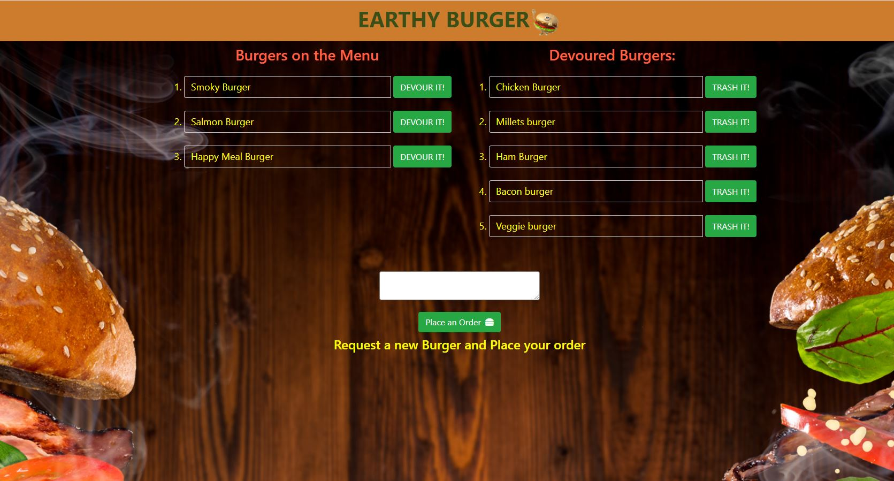

# EARTHY BURGER

 

## DESCRIPTION

 EARTHY BURGER is a restaurant application that lets users to input the names of burgers they would like to eat.

## USAGE

* Whenever a user submits a burger's name,app will display the burger on the left side of the page -- waiting to be devoured.

* Each burger in the waiting area also has a `Devour it!` button. When the user clicks it, the burger will move to the right side of the page.

* Burgers that are devoured have an option to trash them, i.e., this deletes the burger from database. 

* This app will store every burger in a database, whether devoured or not.

## URL Deployed on Heroku

https://glacial-river-89645.herokuapp.com/

